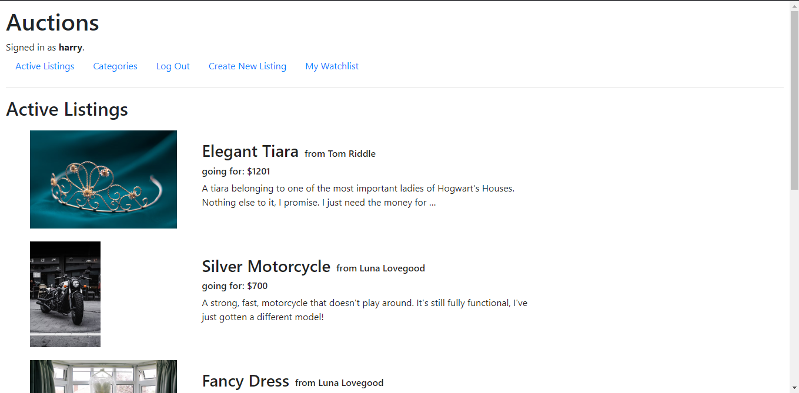
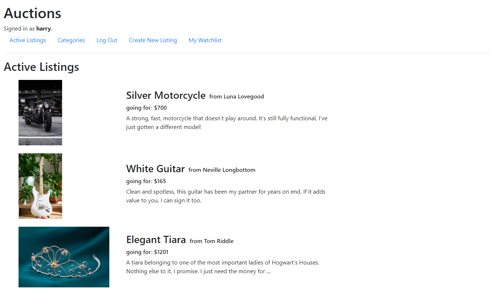
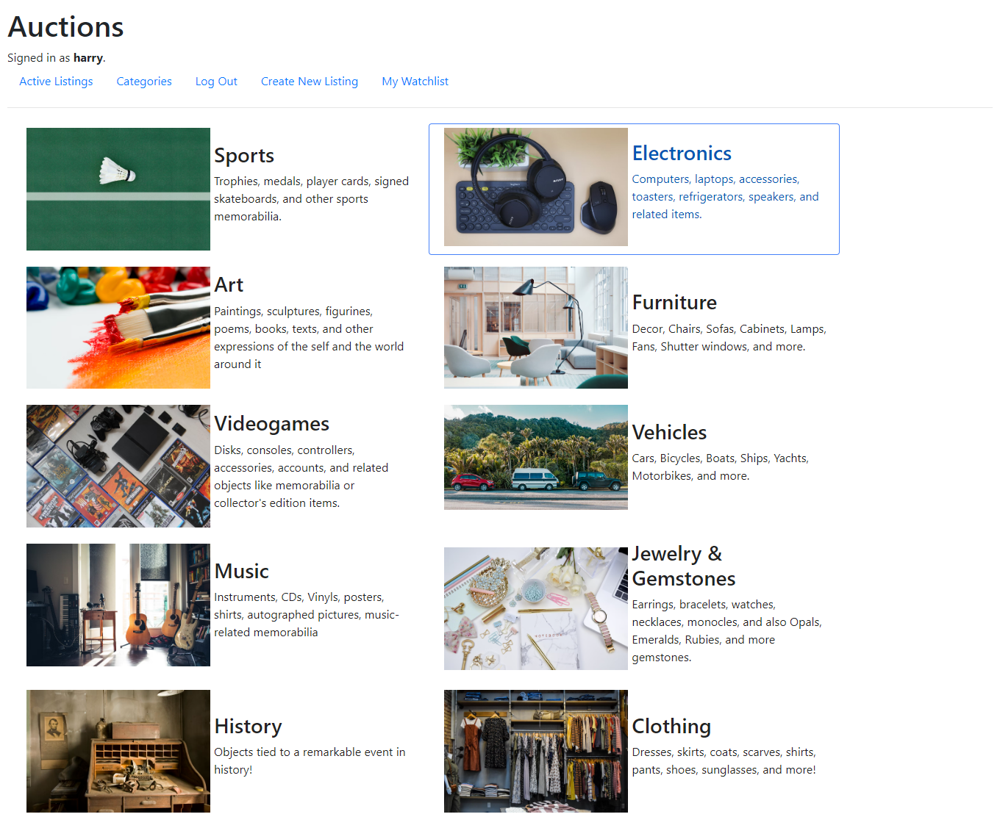
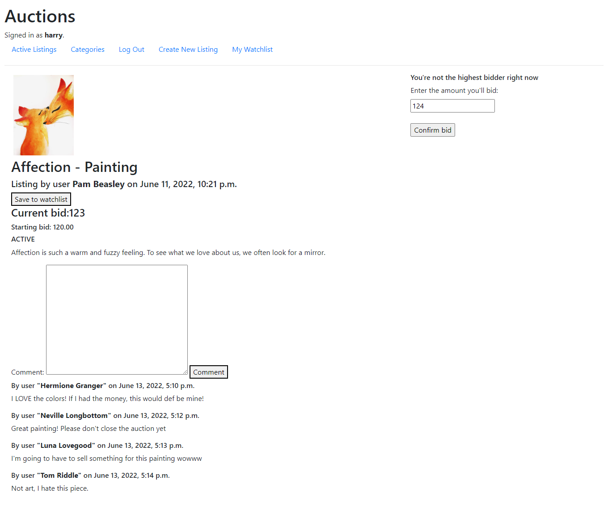
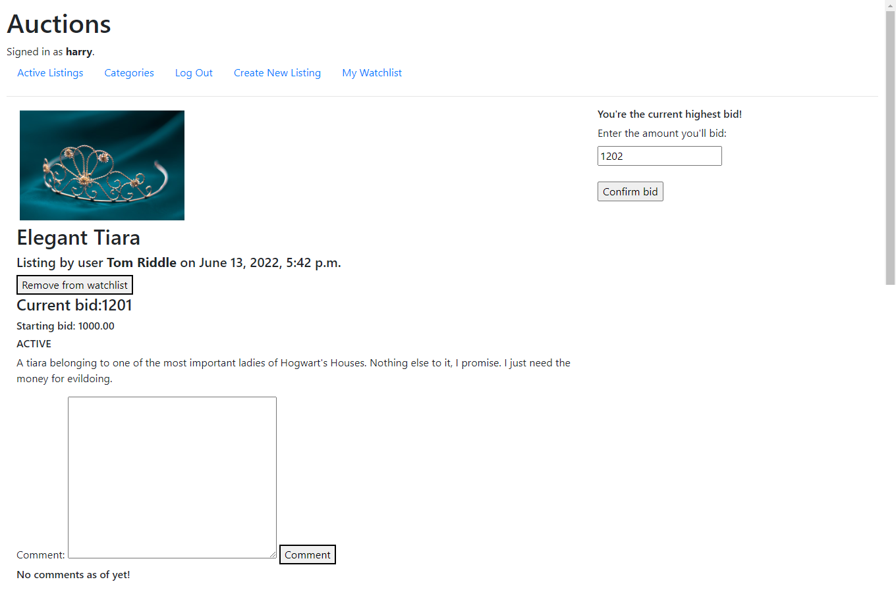

## Commerce

[Check the main repo](https://github.com/JorgeEncinas/CS50-Web-Compiled)

An Auctions website, where users can create Auctions, and also Bid on them. This project starts you off on using Models.
 Said models can give you a pretty good idea on the functionality implemented:

<ul>
  <li>Listing</li>
  <li>Category</li>
  <li>Bid</li>
  <li>Comment</li>
</ul>

[Project Requirements specified here](https://cs50.harvard.edu/web/2020/projects/2/commerce/)

### Images

